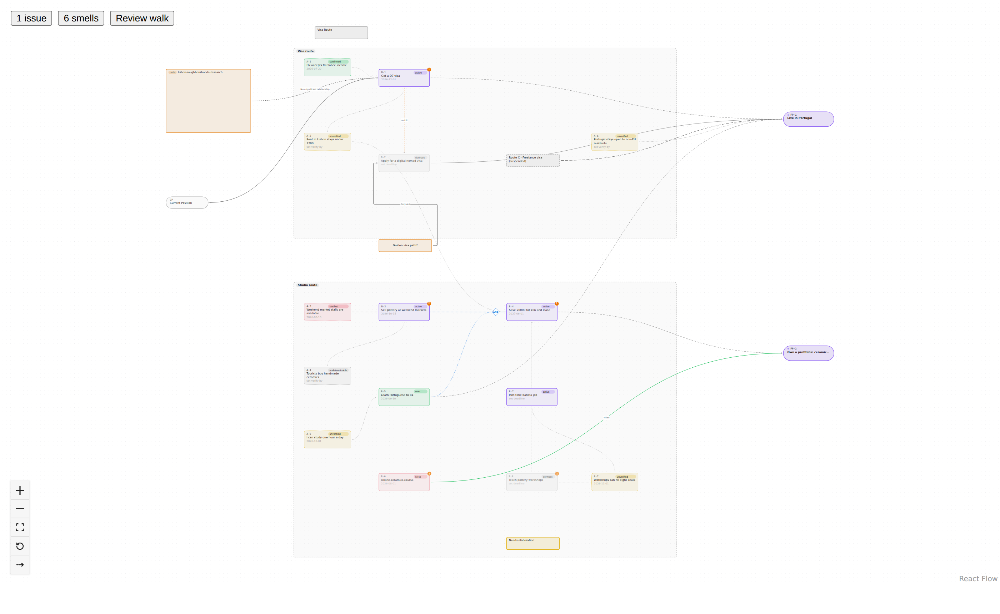
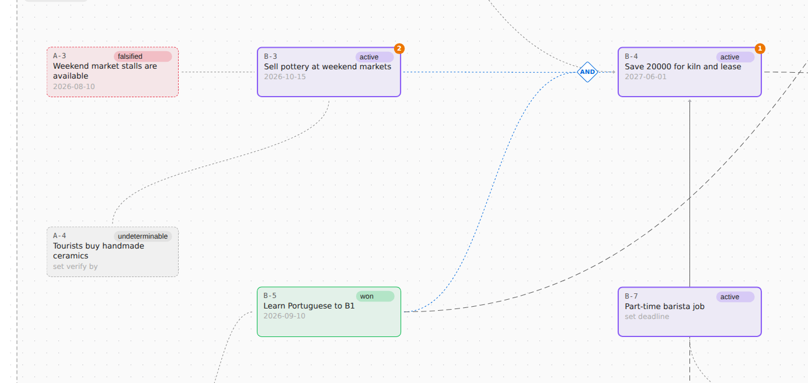
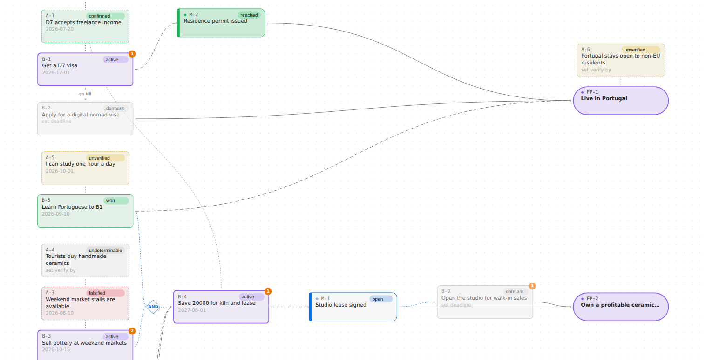
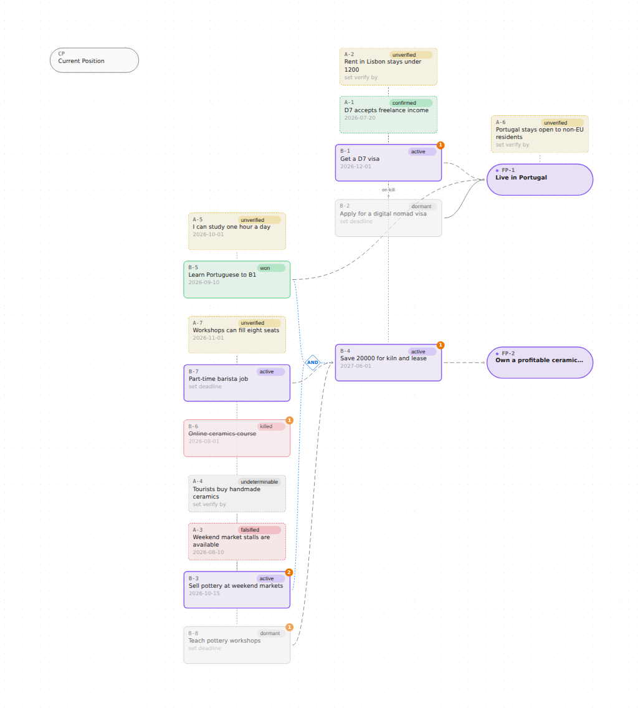
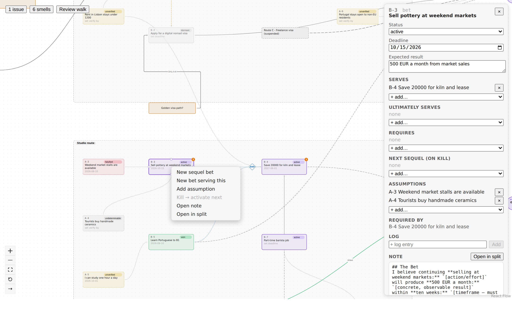
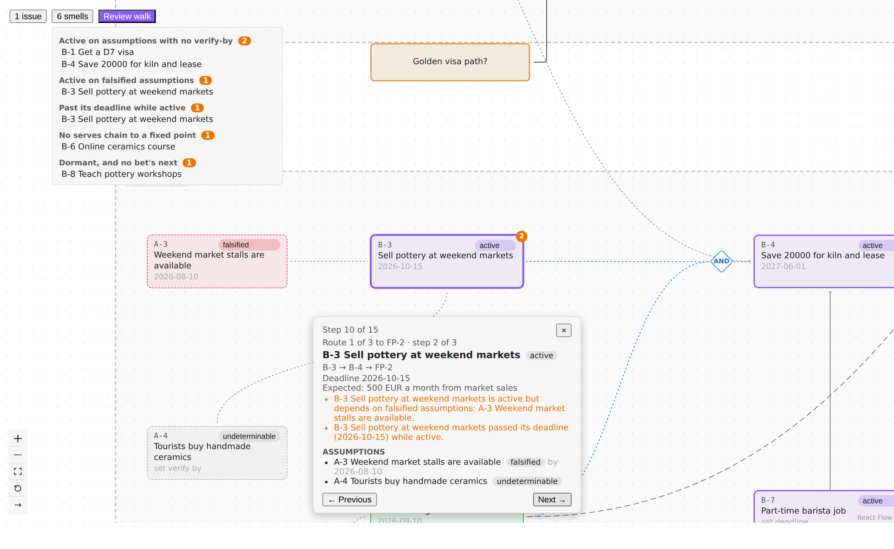
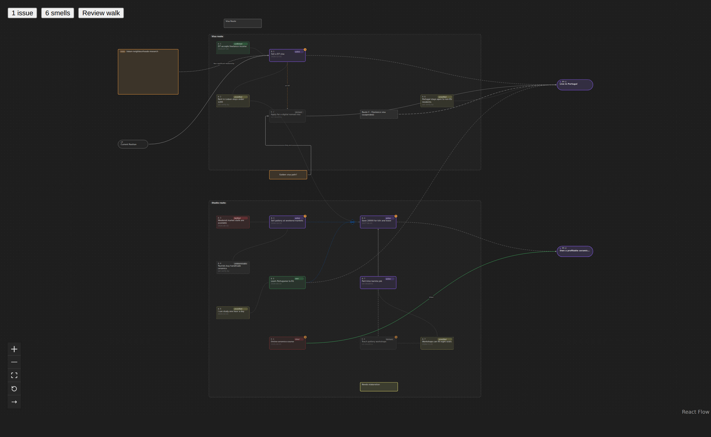

# Grand Strategy Graph

An Obsidian plugin (`strategy-bet-creator`) for running a personal **Grand Strategy** out of your vault.
You write down bets, the assumptions they rest on, milestones and the fixed points they all work
toward, each as an ordinary note. The plugin draws them as a live graph. Nothing about the graph is
stored on its own: every box and arrow comes from the notes' frontmatter. The only extra file holds
where you dragged things.



*Every picture here is the synthetic test vault in `test-vault/`: someone planning a move to Portugal
and a ceramics studio there. It's test data, not a real strategy.*

## The building blocks

Each strategy note has an `id` and a `type`. Relations are plain wiki-links in frontmatter, so they
also show up in Obsidian's Properties panel, in backlinks and in Dataview.

| Type | What it is | Statuses |
|---|---|---|
| **Fixed point** (`FP-n`) | Where the strategy is going: the things you've decided are not up for negotiation, like *Live in Portugal*. Pill-shaped, and it can't be dragged. | — |
| **Bet** (`B-n`) | A time-boxed action: *I believe doing X will produce Y by Z.* It `serves` a bet, milestone or fixed point. | `active` · `dormant` · `won` · `killed` · `extended` |
| **Assumption** (`A-n`) | Something a bet (or milestone, or fixed point) relies on, with a date you'll know by and how you'd know it's false. | `unverified` · `confirmed` · `falsified` · `undeterminable` |
| **Milestone** (`M-n`) | A checkpoint on the way to a fixed point: the place later bets start from. | `open` · `reached` |
| **Current position** (`CP`) | Where you are today. The leftmost point of the graph. | — |

### Bets and assumptions



Colour shows status. Active bets are purple, won ones green, dormant ones grey, killed ones red and
struck through. An assumption sits next to the note that depends on it, joined by a thin dashed leader:
amber while unverified, green when confirmed, red when falsified, grey when undeterminable.

The relations are:

- **`serves`**: solid arrow, toward a bet, milestone or fixed point. It's dashed while the bet leans
  on an assumption that isn't confirmed yet.
- **`requires`**: dotted blue. A bet can't start until its prerequisites are done. A note that requires
  two or more others gets an automatic **AND** junction: above, *Save 20000 for kiln and lease* needs
  both *Sell pottery at weekend markets* and *Learn Portuguese to B1*. Adding "H requires X" also writes
  "X serves H".
- **`next`**: dashed, labelled *on kill*. The sequel bet that takes over if this one is killed.
- **`ultimately-serves`**: the far fixed point. Hidden unless you turn it on (the last button in the
  controls), or the bet has no `serves` chain to a fixed point.

The orange numbers are smells (see [Smells and the review walk](#smells-and-the-review-walk)).

### Milestones



A milestone is a checkpoint between bets. Bets that work toward it `serve` it. Bets that start from it
list it in `requires`, and the milestone `serves` them (the plugin writes that side for you). It can also
serve a fixed point or the next milestone. So the chain reads
*bets → milestone → further bets → next milestone or fixed point*. Above, *Save 20000 for kiln and lease* serves the
open milestone *Studio lease signed*, and *Open the studio for walk-in sales* requires it, so it stays
dormant until the lease is signed. On the visa route, *Residence permit issued* is already `reached`
(green). An active bet that requires an open milestone is a smell.

*The test vault keeps its Milestones folder empty, as in the vault it models. For this picture
`tools/readme-screenshots.ts` adds M-1, M-2 and B-9 in memory.*

## The graph

Open **Strategy graph** from the ribbon or the command palette. It opens `Strategy/Strategy.gsmap` as
a tab. The graph is rebuilt from the notes whenever one changes. The `.gsmap` file keeps only node
positions (by `id`), the viewport, and the free-form canvas items below.

### Layout: left to right is time



Any note you haven't placed yourself is laid out automatically (ELK). Time runs left to right: the
current position, then bets and milestones along their `serves`/`requires` chains, then the fixed
points. Assumptions are never on the time axis: each sits above the note that hosts it. A `next`
sequel sits under the bet it follows.

Dragging works like an Obsidian canvas: box-select, Shift/Cmd-click, arrow-key nudges, Space-drag or
a two-finger swipe to pan. A dragged bet takes its assumptions with it and pushes its prerequisites
left if they get too close. Positions are saved only when a drag ends, and only for the nodes that
moved. The reset button in the controls goes back to the automatic layout.

### Editing from the graph



Select a note to open the **inspector**. There you can change its status, deadline or verify-by date,
expected result and falsifier, add or remove relations, append a dated line under `## Log`, and read
the note. Right-click for quick actions: *New sequel bet*, *New bet serving this*, *Add assumption*,
and *Kill → activate next*, which kills the bet, activates its sequel and logs it in both notes in one
step. Drag from a node's handle to another node to draw a relation. Every edit is a small frontmatter
change through Obsidian's own APIs. The list of the ways a note can change is in `src/core/writes.ts`.

### Free cards, frames and note cards

The graph keeps what was useful about a canvas. It has **free cards** (the orange *Golden visa path?*)
for loose ideas, which you can later promote to a real bet, assumption or milestone. It has
**frames** (*Visa route*, *Studio route*) for grouping. You can drop any vault note in as a
**note card** (*lisbon-neighbourhoods-research*). None of these are written to your notes.

### Smells and the review walk



The plugin flags strategy smells on the nodes and lists them in a panel:

- an active bet on unverified assumptions with no verify-by date
- an active bet on a falsified assumption
- an active bet past its deadline
- a bet with no `serves` chain to a fixed point
- a fixed point nothing serves
- a dormant bet that isn't any bet's `next`
- an active bet that requires a milestone that's still open

**Review walk** steps through the strategy one note at a time, the way it was broken down: each fixed
point, then each route that leads to it, followed back to your current position before the next route
starts ("Route 1 of 3 to FP-2 · step 2 of 3"). Each note comes up once: a route that meets a note
already walked stops there and says so ("Also builds on B-5"). Each step shows the note's path, dates,
smells and assumptions. Bets and milestones on no route aren't walked; the
smells panel lists them.

### Dark theme

The graph uses Obsidian's CSS variables, so it follows your theme.



## Creating notes

Three commands open forms that write a ready-made note:

- **Create new Bet** (ribbon: target icon). Has fields for what it serves and requires, its sequel and
  its assumptions.
- **Create new Assumption** (ribbon: link icon). Can attach to existing bets.
- **Create new Milestone**. Starts as `status: open`.

**Reveal note in graph** jumps from the open note to its node.

## Migrating an existing vault

`tools/migrate.ts` converts a vault from the plugin's older format, and the hand-drawn
`The Map.canvas`, into this schema. It keeps the canvas positions, groups, cards and labelled edges. It
runs as a dry run by default and writes a report and a diff outside the vault. Any edge it can't
classify comes back as a question for you, not a guess.

```sh
npm run migrate -- --vault <copy-of-vault> [--resolutions <file>] [--out <dir>]
```

`--apply` writes into the vault, after a backup to `~/strategy-backups/`. It refuses if anything
changed since the dry run you reviewed. Run it once, with Obsidian closed.

## Installing

Releases are published on GitHub and install through [BRAT](https://github.com/TfTHacker/obsidian42-brat):
add this repository in BRAT and it fetches `main.js`, `manifest.json` and `styles.css` from the latest
release. A vault in the old format must be migrated before it gets a release (see above).

## Development

```sh
npm ci              # install
npm test            # Vitest
npm run typecheck   # tsc --noEmit
npm run build       # esbuild -> dist/
npm run dev:web     # the graph over the test vault at http://localhost:5173, no Obsidian needed
npm run test:e2e    # Playwright against that dev page
npm run screenshots # regenerate the pictures in this README (with dev:web running)
```

- `src/core/` is pure TypeScript: the schema, graph, smells, layout and edit planners. It never
  imports `obsidian`.
- `src/obsidian/` is the Obsidian adapter: modals, the graph view and commands.
- `src/ui/` holds the React Flow components, shared by the plugin and the dev page.
- `test-vault/` is a synthetic vault in the old format. Each note covers a data anomaly; see
  `test-vault/ANOMALIES.md`. Open it in Obsidian to try the latest build: its plugin folder links to
  `dist/`.

The design decisions and the phase plan are in
[`docs/plans/2026-09-30-strategy-graph.md`](docs/plans/2026-09-30-strategy-graph.md). Rules for
contributors (and for Claude) are in [`CLAUDE.md`](CLAUDE.md).

## License

[MIT](LICENSE)
